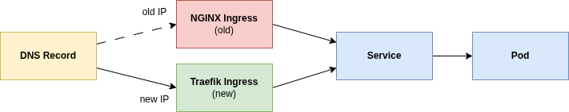

# Zero-Downtime Migration: ingress-nginx to Traefik

ingress-nginx reaches end-of-life in March 2026. This repository provides a step-by-step blueprint for migrating to Traefik with zero downtime.

Each step is a self-contained folder with an idempotent `apply.sh` script.

## TLDR

Install Traefik next to ingress-nginx, duplicate your Ingress resources, switch DNS, then clean up.



## Prerequisites

- `kubectl` configured for your target cluster
- `helm` v3
- A Kubernetes cluster with LoadBalancer support (e.g. cloud provider, MetalLB)

## Chart Versions

| Chart         | Version | App Version |
| ------------- | ------- | ----------- |
| ingress-nginx | 4.14.3  | v1.14.3     |
| traefik       | 39.0.0  | v3.6.7      |

## Steps

### 01 - Baseline

Install ingress-nginx and deploy a sample application behind it.

```bash
./01-baseline/apply.sh
```

Verify:

```bash
curl http://<NGINX_IP>/sample-app
```

### 02 - Install Traefik

Install Traefik alongside ingress-nginx. Each controller gets its own LoadBalancer IP.

```bash
./02-traefik-install/apply.sh
```

Verify:

```bash
kubectl get svc -n traefik
```

### 03 - Dual Ingress

Create a second Ingress resource for Traefik so both controllers serve the sample app simultaneously.
In practice, consider the [NGINX Migration Report by Traefik](https://github.com/traefik/ingress-nginx-migration) to see what needs change.

```bash
./03-dual-ingress/apply.sh
```

Verify:

```bash
curl http://<TRAEFIK_IP>/sample-app
```

### 04 - Switch DNS

Print both LoadBalancer IPs and instructions for updating DNS records.

```bash
./04-switch-dns/apply.sh
```

No cluster changes are made. Update your DNS A record to point to the Traefik IP and wait for propagation. Keep ingress-nginx running for 24-48 h.

### 05 - Remove nginx Ingress Resource

Delete the nginx Ingress resource. Traefik becomes the sole ingress controller.

```bash
./05-remove-nginx-ingress/apply.sh
```

Verify:

```bash
kubectl get ingress -n sample-app
```

### 06 - Uninstall ingress-nginx

Remove the ingress-nginx Helm release and its namespace.

```bash
./06-uninstall-nginx/apply.sh
```

Verify:

```bash
helm list -A | grep ingress-nginx   # should return nothing
kubectl get ns ingress-nginx         # should return NotFound
```

## Monitoring

Run `monitor.sh` in a separate terminal throughout the migration to track availability:

```bash
./monitor.sh http://<NGINX_IP>
```

The script polls `/sample-app` every second and reports HTTP status codes with colour-coded output. Press Ctrl+C for a summary of total requests, failures, and downtime windows.

Here how it should look like:

```
2026-02-13T14:00:00  OK   200
...
2026-02-13T14:03:59  OK   200
========================================
 Summary
========================================
 Total requests : 240
 Failures       : 0
 Downtime windows:
   (none)
========================================
```

Zero failures. Both ingress controllers serve traffic throughout the migration, so there is no downtime during the DNS switch.
